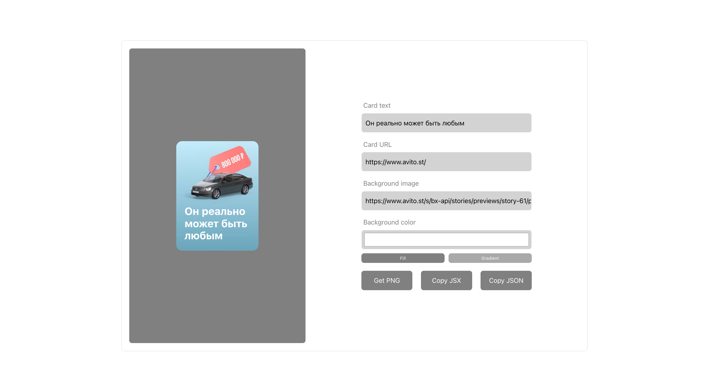

# Тестовое задание на позицию стажера front-end разработки в Авито

Сделано на React c TypeScript
## Запуск
### `npm install && npm start`

Откроет [http://localhost:3999](http://localhost:3999) в браузере для просмотра

## Скриншоты
С картинкой(принимает как ссылку, так и dataURL)

С заливкой цветом

С градиентом

#### По нажатию на "Get PNG" начнется загрузка созданной карточки.
#### По нажатию на "Get JSX" в буфер обмена скопируется JSX-разметка со ссылкой внутри.
#### По нажатию на "Get JSON" в буфер обмена скопируется JSON карточки со всей информацией карточки внутри.
